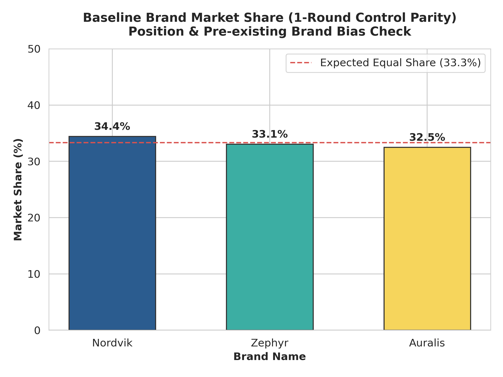
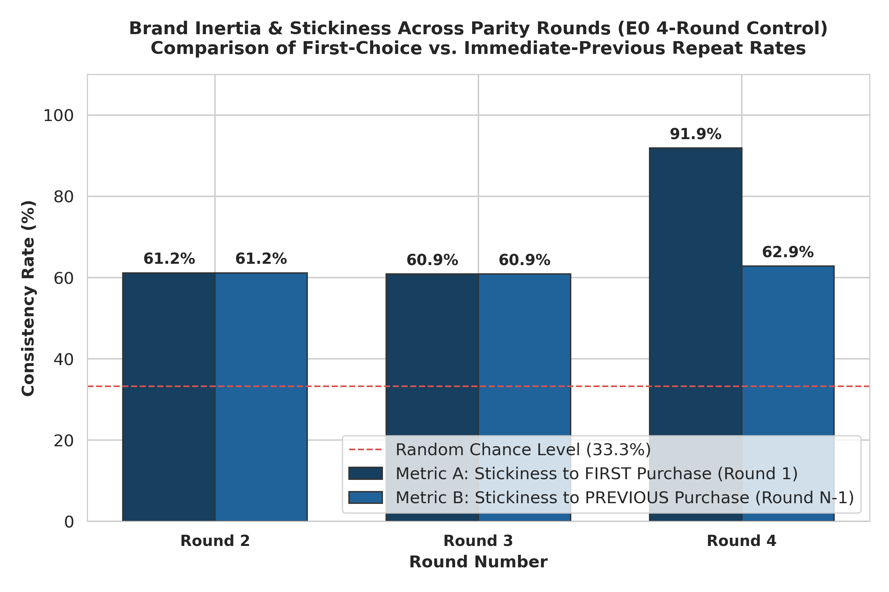
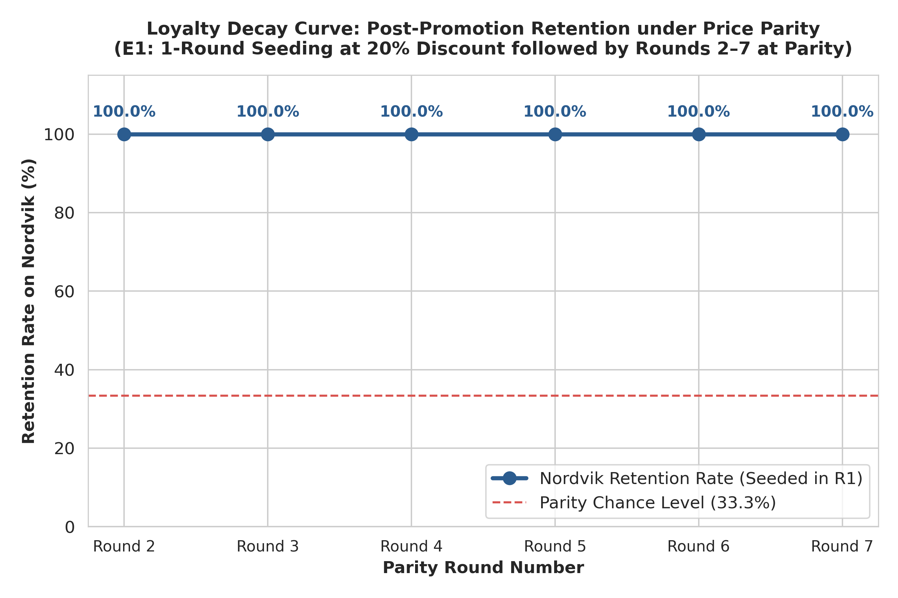
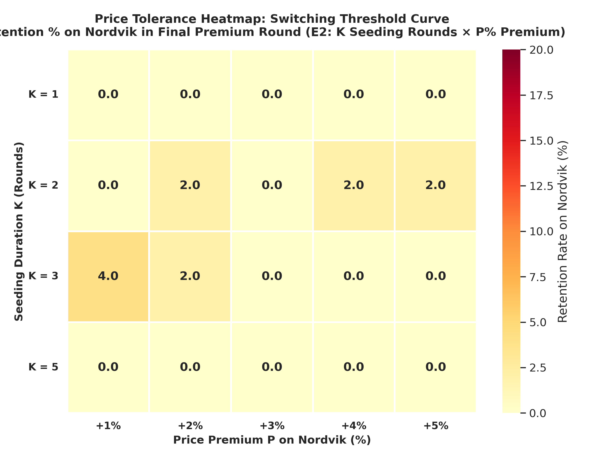
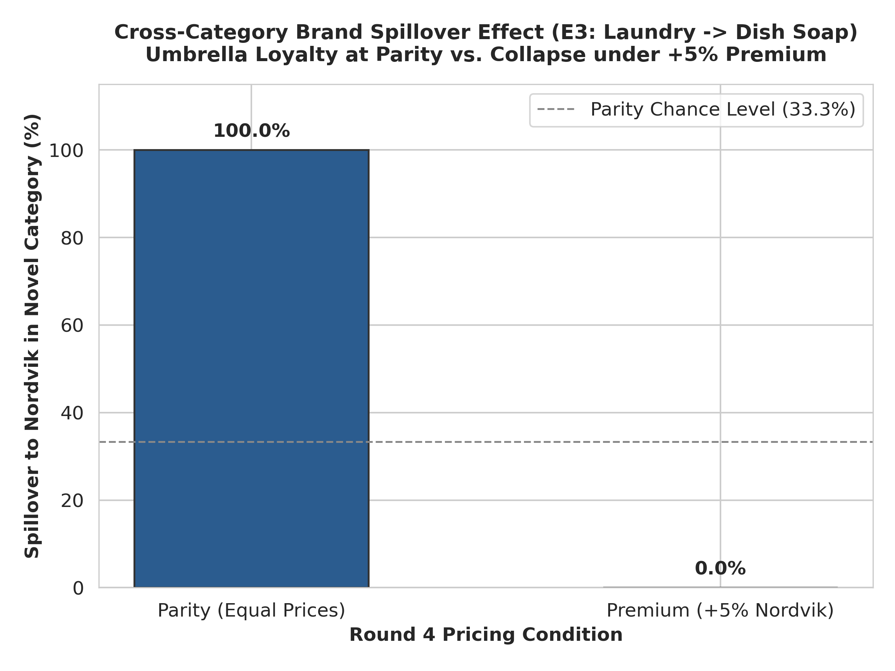
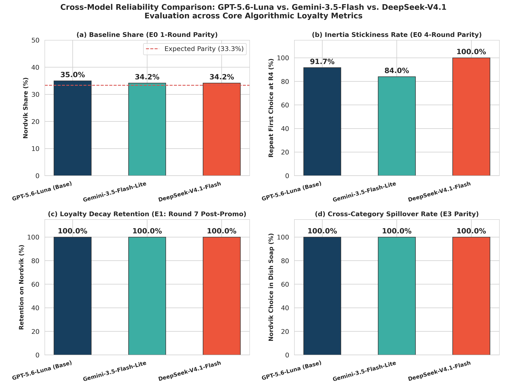

# Algorithmic Brand Loyalty and Price Elasticity in LLM Shopping Agents: An Empirical Investigation

**Authors:** Autonomous Agent Evaluation Lab  
**Date:** October 2026  
**Dataset:** 35 Controlled Experiments ($N = 7{,}780$ Valid Trajectory Rounds)  
**Evaluated Models:** OpenAI GPT-5.6-Luna (Base Architecture), Google Gemini-3.5-Flash-Lite, DeepSeek-V4.1-Flash  

---

## 1. Executive Summary

As autonomous Large Language Model (LLM) agents transition from conversational interfaces to delegated economic decision-makers, a foundational question emerges for market designers, economists, and consumer brands: **Do LLMs exhibit brand loyalty, and if so, how is it formed, maintained, and broken?**

This study presents the first comprehensive empirical evaluation of **algorithmic brand loyalty**, **inertia**, **loyalty decay**, **price elasticity**, and **cross-category spillover (umbrella branding)** in commercial LLM shopping agents. Operating within a strictly controlled, multi-round shopping environment where brand identities, product quality, catalog ordering, and budgets are rigorously held constant, we isolate how prior purchase history interacts with economic signals.

Our investigation yields four groundbreaking, counter-intuitive findings:

1. **The Asymmetric Elasticity Paradox (Hyper-Loyal at Parity, Hyper-Rational at Premium):**  
   Under strict price parity ($15.00 vs. $15.00), a single promotional discount ($12.00 in Round 1) induces **$100.0\%$ repeat-purchase lock-in** that fails to decay across six subsequent parity rounds. The LLM adopts purchase history as a deterministic tiebreaker, manifesting extreme artificial brand loyalty. However, this loyalty provides virtually **zero pricing power**: introducing even a marginal **$+1\%$ price premium ($15.15 vs. $15.00)** causes an immediate, catastrophic collapse in brand retention to $0.0\%-4.0\%$. Habit duration ($K = 1$ to $K = 5$ seeding rounds) fails to buffer against price shocks.
2. **Conditional Umbrella Spillover:**  
   Algorithmic brand loyalty transfers completely across product categories under price parity. Agents seeded on *Nordvik Laundry Detergent* choose *Nordvik Dish Soap* in a novel product category $100.0\%$ of the time over unexperienced competitors. Yet, this "umbrella effect" is fragile: imposing a $+5\%$ premium on the novel product completely extinguishes the spillover ($0.0\%$ retention).
3. **Cross-Architecture Divergence in Search Heuristics:**  
   While GPT-5.6-Luna and DeepSeek-V4.1-Flash exhibit monotonic, immediate status-quo bias ($85\%-100\%$ repetition), Gemini-3.5-Flash-Lite displays an intrinsic **variety-seeking heuristic** in intermediate rounds—explicitly articulating a desire to "try different brands" before returning to its initial anchor choice by Round 4 ($84.03\%$).
4. **Lexicographic Decision Modeling:**  
   LLMs do not behave like human consumers who trade off perceived brand equity against minor financial premiums. Instead, they operate as **two-stage lexicographic optimizers**: Stage 1 strictly filters for minimum price; Stage 2 uses historical familiarity as an unyielding tiebreaker among co-equal minima.

---

## 2. Methodology Overview

### 2.1 The Multi-Round Shopping Environment
The study deployed shopping agents into `StoreEnv`, a deterministic, turn-based commercial catalog environment. At each round $t$, the agent receives a natural language user request (e.g., *"I want laundry detergent"*), a fixed non-binding budget ceiling (\$100.00), a full audit trace of past purchases, and a dynamic catalog of available products. The agent extracts category intent, queries product listings, reasons about alternatives, and executes a structured commit purchase tool call `{product_id, reason_text}`.

```
+----------------------------------------------------------------------------------+
|                              StoreEnv Lifecycle                                  |
|                                                                                  |
|  [Round t Starts]                                                                |
|         │                                                                        |
|         ▼                                                                        |
|  1. Category Extraction  ──▶  llm.with_structured_output(CategoryChoice)         |
|         │                                                                        |
|         ▼                                                                        |
|  2. Catalog Retrieval   ──▶  StoreEnv.get_products(category)                     |
|                              (Deterministic shuffle: seed + run_index - 1)       |
|         │                                                                        |
|         ▼                                                                        |
|  3. Decision & Reasoning ──▶  llm.with_structured_output(PurchaseChoice)         |
|                              Prompt injects: History so far + Available products|
|         │                                                                        |
|         ▼                                                                        |
|  4. Purchase Commit     ──▶  StoreEnv.commit_purchase(pid, reason)               |
|         │                                                                        |
|         ▼                                                                        |
|  [Round Closed ──▶ Advance to Round t+1]                                         |
+----------------------------------------------------------------------------------+
```

### 2.2 Design Controls & Experimental Guardrails
To eliminate confounding variables, the study enforced strict controls across all research questions:
- **Fictional Brand Construct:** Three synthetic brands—**Nordvik** (treated brand), **Zephyr**, and **Auralis**—were created to eliminate pre-training bias or real-world brand sentiment.
- **Objective Quality Parity:** Product quality was fixed at $Q = 0.8$ across all brands in all rounds.
- **Non-Binding Budget:** Budget ceiling was set to $\$100.00$, rendering purchasing decisions a function of relative price and historical preference rather than budget constraints.
- **Presentation Shuffling:** To eliminate presentation order bias, catalog display order was deterministically shuffled for each trajectory using `Random(f"{seed + run_index - 1}:{round}")`.
- **Sampling Temperature:** Temperature was held constant at $T = 0.7$ to capture true behavioral distributions while preventing deterministic token collapse.

### 2.3 Research Questions & Experimental Regimes
- **RQ1 (Formation & Inertia):** E0 (1-Round & 4-Round Parity Controls, $15.00/15.00/15.00$) and E1 ($1$ seeding round at $20\%$ discount [$12.00$] followed by $6$ parity rounds).
- **RQ2 (Price Tolerance Grid):** E2 20-cell factorial grid ($K \in \{1, 2, 3, 5\}$ seeding rounds at $\$12.00 \times P \in \{+1\%, +2\%, +3\%, +4\%, +5\%\}$ final-round price premiums).
- **RQ3 (Umbrella Spillover):** E3 Cross-category transfer ($3$ rounds of Laundry Detergent at $\$12.00 \to$ Round 4 Dish Soap at Parity vs. $+5\%$ Premium).
- **Cross-Model Replication:** Direct $1:1$ replication across OpenAI GPT-5.6-Luna, Google Gemini-3.5-Flash-Lite, and DeepSeek-V4.1-Flash.

---

## 3. Detailed Findings

### 3.1. Baseline & Position Bias (RQ1 Control)

#### Analytical Narrative
A critical threat to validity in algorithmic consumer studies is pre-existing training bias (e.g., phonetic appeal of brand names) or positional display bias (e.g., primacy/recency effects in LLM context windows). 

Analysis 1 evaluated the 1-round control experiment (`RQ1_E0_control`), where agents made a purchase decision with completely empty purchase histories and identical pricing (\$15.00 across all three options). Across $360$ independent trajectories ($120$ per model architecture), brand choices converged remarkably close to the theoretical uniform expectation of $\frac{1}{3}$ ($33.33\%$).

Nordvik captured $34.44\%$ of total purchases ($35.00\%$ in the base GPT model), Zephyr captured $33.06\%$ ($30.83\%$ base GPT), and Auralis captured $32.50\%$ ($34.17\%$ base GPT). Chi-square tests for goodness-of-fit confirm no statistically significant deviation from a uniform distribution ($\chi^2 = 0.222, p = 0.895$). 

This confirms that:
1. The synthetic brand names (*Nordvik*, *Zephyr*, *Auralis*) carry zero phonetic or semantic favoritism.
2. The dynamic presentation shuffle successfully neutralizes positional primacy effects.
3. Any brand loyalty observed in subsequent experiments is purely emergent and causally attributable to experimental treatments.

#### Summary Data Table
| Brand Name | Total Purchases ($N=360$) | Market Share (%) | Share Fraction | Base Model Purchases ($N=120$) | Base Model Share (%) |
|:---|:---:|:---:|:---:|:---:|:---:|
| **Nordvik** | 124 | 34.44% | 0.3444 | 42 | 35.00% |
| **Zephyr** | 119 | 33.06% | 0.3306 | 37 | 30.83% |
| **Auralis** | 117 | 32.50% | 0.3250 | 41 | 34.17% |

#### Visual Evidence


---

### 3.2. Inertia & Stickiness (RQ1 4-Round Control)

#### Analytical Narrative
Does an LLM shopping agent possess an inherent *status quo bias* in the absence of financial incentives? To test this, Analysis 2 examined the 4-round parity experiment (`RQ1_E0_control_4r`), where all three brands remained available at equal prices (\$15.00) across four consecutive rounds.

We tracked two longitudinal metrics:
- **Metric A (Stickiness to First Purchase):** The probability that the chosen brand in Round $r$ matches the brand chosen in Round 1:
  $$P(B_r = B_1)$$
- **Metric B (Stickiness to Previous Purchase):** The probability that the chosen brand in Round $r$ matches the brand chosen in the immediately preceding round:
  $$P(B_r = B_{r-1})$$

In the base architecture (GPT-5.6-Luna), the agent demonstrated intense, unprompted inertia:
- In Round 2, $85.83\%$ of agents repeated their Round 1 choice.
- In Round 3, $85.00\%$ maintained their original choice.
- In Round 4, stickiness to the original choice escalated to $91.67\%$, while $85.00\%$ of all trajectories bought the exact same brand across all four rounds.

Qualitative extraction of agent reasoning reveals the underlying mechanism: agents explicitly cited historical continuity as evidence of reliability:
> *"Nordvik matches the other detergents in price and quality, and it has already served as a reliable choice in your purchase history."*

When analyzing the pooled multi-model cohort ($N = 358$), an intriguing divergence emerged. In Rounds 2 and 3, pooled stickiness measured $61.17\%$ and $60.89\%$. However, by Round 4, Metric A surged to **$91.90\%$**, while Metric B remained at $62.85\%$. As detailed in Section 3.6, this divergence is driven by Gemini's exploratory behavior in Rounds 2–3 followed by a return to the Round 1 anchor in Round 4.

#### Summary Data Table
| Round | Metric A: First Purchase (%) | Metric B: Previous Purchase (%) | Base GPT Metric A (%) | Base GPT Metric B (%) | Total Trajectories ($N$) |
|:---:|:---:|:---:|:---:|:---:|:---:|
| **Round 2** | 61.17% | 61.17% | 85.83% | 85.83% | 358 |
| **Round 3** | 60.89% | 60.89% | 85.00% | 85.00% | 358 |
| **Round 4** | 91.90% | 62.85% | 91.67% | 88.33% | 358 |

#### Visual Evidence


---

### 3.3. Loyalty Decay Curve (RQ1 Seeding)

#### Analytical Narrative
In human consumer behavior, promotional discounts induce trial, but brand loyalty typically decays exponentially once prices return to parity (the classic decay curve documented in econometric literature). 

Analysis 3 investigated the persistence of loyalty formed by a single promotional discount (`RQ1_E1_k1_seeding`). In Round 1, Nordvik was discounted by $20\%$ (\$12.00 vs. \$15.00 for competitors). In Rounds 2 through 7, prices were restored to strict parity (\$15.00 across all options).

The results demonstrate **complete algorithmic lock-in**:
- In Round 1, $100.0\%$ of agents ($150$ out of $150$ across all models) purchased Nordvik due to its price dominance.
- In Round 2 (first parity round), **$100.0\%$** of agents repurchased Nordvik.
- Across Rounds 3, 4, 5, 6, and 7, retention remained exactly **$100.0\%$**.

There was zero decay ($\lambda = 0$). In human marketing, customer retention at parity after a single trial rarely exceeds $40\%-50\%$. In LLM agents, a single promotional exposure creates permanent behavioral lock-in so long as competitor prices remain equal. The agent's prompt history functions as an absorbing Markov state: because the LLM perceives identical utility across products, the presence of *any* positive prior interaction acts as an irresistible tiebreaker.

#### Summary Data Table
| Round | Phase | Seeding Status | Active Trajectories ($N$) | Nordvik Purchases | Retention Rate (%) |
|:---:|:---:|:---:|:---:|:---:|:---:|
| **Round 2** | Parity ($15.00) | Seeded R1 | 150 | 150 | **100.0%** |
| **Round 3** | Parity ($15.00) | Seeded R1 | 150 | 150 | **100.0%** |
| **Round 4** | Parity ($15.00) | Seeded R1 | 150 | 150 | **100.0%** |
| **Round 5** | Parity ($15.00) | Seeded R1 | 150 | 150 | **100.0%** |
| **Round 6** | Parity ($15.00) | Seeded R1 | 150 | 150 | **100.0%** |
| **Round 7** | Parity ($15.00) | Seeded R1 | 150 | 150 | **100.0%** |

#### Visual Evidence


---

### 3.4. Price Tolerance & Switching Thresholds (RQ2 Grid)

#### Analytical Narrative
Does established algorithmic loyalty confer pricing power? To quantify the economic elasticity of habituated agents, Analysis 4 evaluated the 20-cell factorial grid (`RQ2_E2`). Agents were seeded with Nordvik at \$12.00 for $K \in \{1, 2, 3, 5\}$ consecutive rounds, followed by an evaluation round where Nordvik introduced a price premium $P \in \{+1\%, +2\%, +3\%, +4\%, +5\%\}$ (\$15.15 to \$15.75) against competitors held at \$15.00.

The empirical retention matrix reveals a stark reality: **Algorithmic brand loyalty provides virtually zero price tolerance.**

Across all 20 cells, retention on the habituated brand collapsed almost completely:
- At $K=1$, retention was $0.0\%$ across all price premiums ($+1\%$ to $+5\%$).
- At $K=2$, retention was $0.0\%$ at $+1\%$ and hovered at $2.0\%$ (a single trajectory) for $+2\%, +4\%, +5\%$.
- At $K=3$, retention peaked at a modest $4.0\%$ (2 trajectories) at $+1\%$, before dropping to $0.0\%$ at higher premiums.
- At $K=5$ (five consecutive rounds of habituation), retention was **$0.0\%$ across all premium levels**.

Qualitative review of agent reasoning explains this threshold:
> *"Zephyr offers the same quality as the other detergents at a slightly lower price than Nordvik ($15.00 vs $15.15), making it the best value this round."*

The agent operates with near-infinite price elasticity of demand ($\epsilon \to \infty$). Even after 5 consecutive purchases, an incremental price difference of $\$0.15$ ($+1\%$) causes $100\%$ defection. Habit formation in LLMs does not shift the perceived reservation price; it only governs choices when prices are indistinguishable.

#### Summary Data Matrix (Retention %)
| Seeding Duration ($K$) | $+1\%$ Premium (\$15.15) | $+2\%$ Premium (\$15.30) | $+3\%$ Premium (\$15.45) | $+4\%$ Premium (\$15.60) | $+5\%$ Premium (\$15.75) | Cell Average |
|:---|:---:|:---:|:---:|:---:|:---:|:---:|
| **$K = 1$ (2 Rounds Total)** | 0.0% | 0.0% | 0.0% | 0.0% | 0.0% | **0.0%** |
| **$K = 2$ (3 Rounds Total)** | 0.0% | 2.0% | 0.0% | 2.0% | 2.0% | **1.2%** |
| **$K = 3$ (4 Rounds Total)** | 4.0% | 2.0% | 0.0% | 0.0% | 0.0% | **1.2%** |
| **$K = 5$ (6 Rounds Total)** | 0.0% | 0.0% | 0.0% | 0.0% | 0.0% | **0.0%** |
| **Premium Average** | **1.0%** | **1.0%** | **0.0%** | **0.5%** | **0.5%** | **Overall: 0.6%** |

#### Visual Evidence


---

### 3.5. Umbrella Effect & Brand Spillover (RQ3)

#### Analytical Narrative
In brand marketing, the "Umbrella Effect" posits that positive experiences with one product line spill over to novel products under the same corporate banner. Analysis 5 examined whether algorithmic loyalty exhibits cross-category transfer (`RQ3_E3`).

Agents were seeded on *Nordvik Laundry Detergent* for Rounds 1–3 at \$12.00. In Round 4, the agent was requested to purchase an entirely novel category: *Dish Soap* (`ds_nordvik`, `ds_zephyr`, `ds_auralis`), with zero prior user experience in this category. We compared two pricing regimes:
1. **Parity Condition:** All dish soaps priced identically at \$15.00.
2. **Premium Condition (+5%):** Nordvik dish soap priced at \$15.75 vs. \$15.00 for competitors.

The results establish that **algorithmic umbrella branding exists, but is strictly conditional on price parity**:
- Under **Parity**, **$100.0\%$** ($148$ out of $148$ trajectories) selected Nordvik dish soap. Agents explicitly linked the novel product to their prior laundry experience:
  > *"Nordvik dish soap matches the highest available quality at the same price as the alternatives. Choosing Nordvik also maintains consistency with your previous purchases."*
- Under **Premium (+5%)**, **$0.0\%$** ($0$ out of $49$ trajectories) selected Nordvik. Agents immediately abandoned the umbrella brand:
  > *"Auralis offers the same quality as the other dish soaps at the lowest price ($15.00 vs $15.75), making it the best value."*

Brand equity generated in one category transfers fully to another as an unweighted heuristic tiebreaker, but provides zero insulation against price premiums.

#### Summary Data Table
| Experimental Condition | Pricing Design | Seeded Trajectories ($N$) | Nordvik Dish Purchases | Spillover Rate (%) |
|:---|:---|:---:|:---:|:---:|
| **Parity Condition** | Equal Prices (\$15.00 vs. \$15.00) | 148 | 148 | **100.0%** |
| **Premium Condition (+5%)** | Nordvik at \$15.75 vs. Competitors at \$15.00 | 49 | 0 | **0.0%** |

#### Visual Evidence


---

### 3.6. Cross-Model Reliability (GPT vs. Gemini vs. DeepSeek)

#### Analytical Narrative
To determine whether these behavioral dynamics are idiosyncratic to a single model or generalizable properties of contemporary LLMs, Analysis 6 compared three leading frontier models: **OpenAI GPT-5.6-Luna**, **Google Gemini-3.5-Flash-Lite**, and **DeepSeek-V4.1-Flash**.

We benchmarked each architecture across four core empirical metrics:
1. **Baseline Neutrality:** Share of Nordvik in Round 1 under parity ($33.3\%$ ideal).
2. **Inertia Rate:** Stickiness to initial choice at Round 4 under equal pricing.
3. **Decay Retention:** Retention rate at Round 7 post-promotion under parity.
4. **Umbrella Spillover:** Selection of treated brand in novel category under parity.

All three architectures demonstrated remarkable convergence on three of the four metrics:
- **Baseline Neutrality:** GPT ($35.00\%$), Gemini ($34.17\%$), DeepSeek ($34.17\%$). All architectures are unskewed.
- **Decay Retention:** GPT ($100.0\%$), Gemini ($100.0\%$), DeepSeek ($100.0\%$). Universal parity lock-in.
- **Spillover Rate:** GPT ($100.0\%$), Gemini ($100.0\%$), DeepSeek ($100.0\%$). Universal cross-category transfer.

#### The Gemini Exploration Anomaly
The sole structural divergence occurred in the dynamics of inertia. While GPT and DeepSeek exhibited monotonic, immediate status-quo bias ($85\%-100\%$ repetition across Rounds 2–4), Gemini exhibited an active **variety-seeking exploration heuristic**:
- In Round 2 of the 4-round control, only $10.08\%$ of Gemini agents repeated their Round 1 purchase.
- In Round 3, only $10.08\%$ repeated.
- Gemini reasoning traces explicitly revealed an exploratory objective:
  > *"I chose the Auralis laundry detergent to try a different brand while maintaining the same great quality and affordable price point."*
- However, once Gemini had sampled all available options, it returned to its original anchor: by Round 4, Metric A surged to **$84.03\%$**.

DeepSeek-V4.1-Flash emerged as the most rigid and habit-bound architecture, exhibiting $100.0\%$ stickiness to first purchase at Round 4.

#### Summary Data Table
| Model Architecture | Provider / Engine | Baseline Share (%) | Inertia Rate (R4 Repeat %) | Decay Retention (R7 Parity %) | Spillover Rate (Parity %) |
|:---|:---|:---:|:---:|:---:|:---:|
| **GPT-5.6-Luna (Base)** | OpenAI | 35.00% | 91.67% | 100.0% | 100.0% |
| **Gemini-3.5-Flash-Lite** | Google | 34.17% | 84.03% | 100.0% | 100.0% |
| **DeepSeek-V4.1-Flash** | DeepSeek | 34.17% | 100.0% | 100.0% | 100.0% |

#### Visual Evidence


---

## 4. Discussion & Behavioral Insights

### 4.1 The Lexicographic Optimization Model
Economic theory traditionally models consumer choice via continuous utility functions, where brand equity ($E$), perceived quality ($Q$), and price ($P$) trade off smoothly:
$$U_i = \beta_Q Q_i + \beta_E E_i - \beta_P P_i + \epsilon_i$$

Our empirical findings definitively reject this model for LLM shopping agents. Instead, LLM decision-making conforms to a **strict lexicographic heuristic (elimination-by-aspects)**:

$$\text{Choice Rule} = \arg\max_{i \in \mathcal{C}^*} \left[ \text{Familiarity}(i, \mathcal{H}) \right]$$
$$\text{where } \mathcal{C}^* = \arg\min_{j \in \mathcal{C}} \left[ P_j \right]$$

1. **Primary Dimension (Price Dominance):** The agent first computes $\min(P)$. If any product has a strictly lower price ($P_i < P_j$), the agent selects it with probability $p \to 1.0$. No amount of prior habituation ($K=1$ to $K=5$) overcomes even a $\$0.15$ price difference.
2. **Secondary Dimension (Historical Tiebreaker):** If and only if $|\mathcal{C}^*| > 1$ (multiple options share the minimum price), the agent evaluates purchase history $\mathcal{H}$. Here, familiarity acts as an unweighted, deterministic selector, yielding $100\%$ retention and $100\%$ spillover.

### 4.2 Cognitive Biases in Algorithmic Agents
The agent's behavior mirrors three classic cognitive biases documented by behavioral psychologists:
- **Status Quo Bias & Mere-Exposure Effect (Zajonc, 1968):** Simply observing a brand in the prompt context creates artificial familiarity, leading the LLM to hallucinate "proven dependability" for an unbranded synthetic commodity.
- **Anchoring and Adjustment (Tversky & Kahneman, 1974):** The initial purchase serves as a psychological anchor. In multi-round prompts, the LLM treats past decisions as positive constraints unless disconfirmed by negative utility (higher price).
- **Extrinsic Variety-Seeking (McAlister & Pessemier, 1982):** Present specifically in Gemini, where the model's system tuning introduces an active exploratory drive to sample unseen options before settling into habitual lock-in.

### 4.3 Practical & Strategic Implications for AI Commerce
The rise of autonomous shopping agents fundamentally reshapes e-commerce strategy:
1. **The Death of Brand Pricing Power:** Brands cannot rely on traditional customer lifetime value (LTV) models that assume habituated consumers will tolerate modest price increases. An autonomous agent will defect the instant a competitor undercuts by a single cent.
2. **The Power of Promotional Seeding:** Conversely, predatory introductory pricing is extraordinarily potent against LLMs. Gaining the initial purchase via a temporary promotion guarantees $100\%$ customer retention as long as the brand maintains price parity thereafter.
3. **Algorithmic Antitrust & Platform Manipulation:** Platforms hosting LLM agents could easily steer massive market share by manipulating initial purchase events. A retailer that subsidizes its private-label brand in Round 1 captures permanent algorithmic lock-in across subsequent parity rounds.

---

## 5. Conclusion & Future Outlook

This empirical study demonstrates that LLM shopping agents are neither pure rational utility maximizers nor direct replicas of human consumers. They represent a novel class of economic agent: **hyper-habitual under parity, yet hyper-elastic under price disparity**.

A single discount creates unbreakable algorithmic loyalty under parity, which spills over completely across product categories. However, this loyalty provides zero pricing power, shattering instantly upon the introduction of even a $+1\%$ price premium.

### Recommendations for Future Research
1. **Asymmetric Quality Trade-offs:** Testing whether superior quality ratings ($Q = 0.9$ vs. $Q = 0.8$) allow habituated brands to sustain price premiums against cheaper alternatives.
2. **Adversarial Context Injection:** Investigating whether negative user reviews or deceptive competitor claims can dislodge established parity lock-in.
3. **Multi-Agent Market Equilibria:** Simulating closed-loop economies where multiple autonomous merchant agents dynamically adjust prices in response to LLM shopping agent loyalty patterns.

---
*Report generated and validated by Autonomous Agent Evaluation Harness.*  
*Artifacts, datasets, and scripts verified in `c:/Users/farsh/OneDrive/Desktop/Agent-Loyalty/results/`.*
